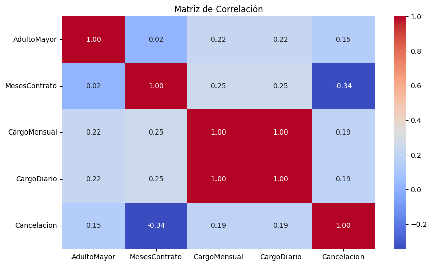
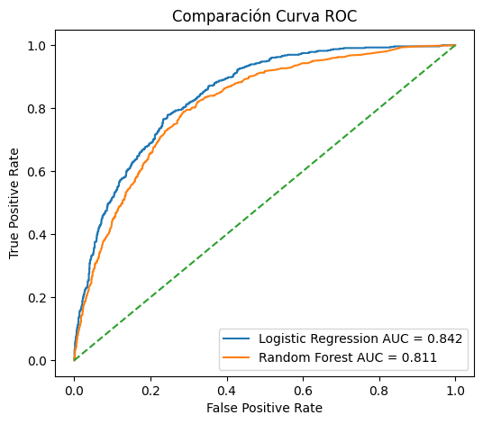
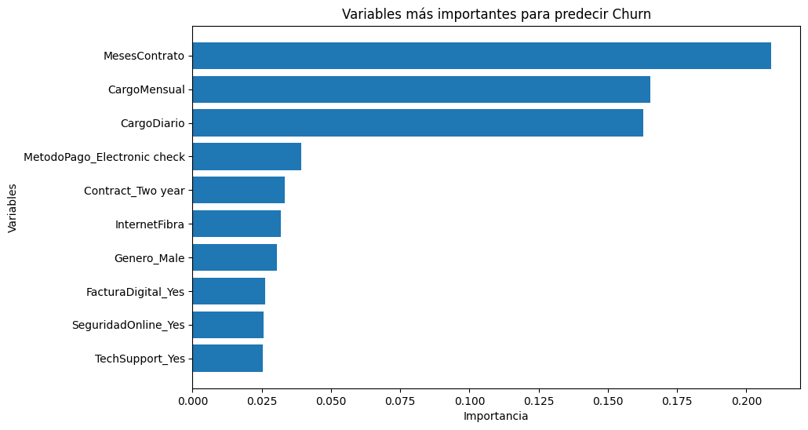

# 📊 Análisis y Predicción de Cancelación de Clientes (Churn)

## 📌 Descripción del Proyecto
Este proyecto analiza los factores asociados a la **cancelación de clientes (churn)** en una empresa de telecomunicaciones, utilizando técnicas de **análisis de datos** y **modelos de aprendizaje automático**.

El objetivo es identificar patrones que permitan anticipar qué clientes tienen mayor probabilidad de cancelar el servicio, apoyando estrategias de retención y mejorando la toma de decisiones.

---

## 📂 Estructura del Proyecto
📁 TelecomX_2 │ ├── 📄 README.md ├── 📄 TelecomX_2Final.ipynb ├── 📄 datos_tratados.csv │ └── 📁 graficos ├── matriz_correlacion.png ├── curva_roc.png └── importancia_variables.png

---

## 🔎 Exploración y Limpieza de Datos
- Identificación y tratamiento de valores nulos  
- Corrección de inconsistencias  
- Conversión de variables categóricas a numéricas (One-Hot Encoding)  
- Creación de nuevas variables (`CargoDiario`)  
- Variables principales: `MesesContrato`, `CargoMensual`, `CargoDiario`, `TipoContrato`, `ServiciosAdicionales`, `MetodoPago`, `Cancelacion`

---

## 📊 Análisis Exploratorio
- Clientes con menos meses de contrato tienen mayor probabilidad de cancelar.  
- Cargos mensuales altos se asocian con mayor tasa de cancelación.  
- Contratos de largo plazo presentan menor churn.  
- Se utilizó una **matriz de correlación (heatmap)** para visualizar relaciones entre variables.  

---

## 🤖 Modelado Predictivo

### 📈 Resultados de Modelos
| Modelo              | Accuracy | Precision | Recall | F1-score |
|---------------------|----------|-----------|--------|----------|
| Regresión Logística | 0.80     | 0.63      | 0.53   | 0.57     |
| Random Forest       | 0.78     | 0.60      | 0.46   | 0.52     |

---

## 📉 Evaluación del Modelo
- Matriz de confusión  
- Curva ROC  

---

## 📈 Variables Más Importantes (Random Forest)
- `MesesContrato`  
- `CargoMensual`  
- `CargoDiario`  
- `MetodoPago`  
- `TipoContrato`  
- `InternetFibra`  

---

## 💡 Conclusiones
- La duración del contrato, los costos y el tipo de servicio son factores clave en la cancelación.  
- Los modelos permiten anticipar clientes con alto riesgo de churn.  
- Esto ayuda a diseñar **estrategias de retención más efectivas**.

---

## 🚀 Posibles Mejoras
- Balanceo de datos (SMOTE)  
- Optimización de hiperparámetros  
- Nuevas variables de comportamiento  
- Modelos adicionales (XGBoost, Gradient Boosting)

---

## 🛠 Tecnologías Utilizadas
- Python  
- Pandas  
- NumPy  
- Matplotlib  
- Seaborn  
- Scikit-learn  
- Jupyter Notebook  

---
## Telecom Parte 1
[TelecomX_1_final.ipynb](https://github.com/Pameta1/Telecom_X/blob/f9f78566786385ba2f56af22171d9e6da253f92a/TelecomX_1_final.ipynb)

## 👩‍💻 Autor
**Pamela Tapia** 
## 🔗 Contacto y Redes

- [LinkedIn – Pamela Tapia Ponce](https://www.linkedin.com/in/pamelatapiaponce/)
- 📧 [pamelatapiaptp@gmail.com]

  Proyecto desarrollado como parte del aprendizaje en **análisis de datos y machine learning aplicado al churn de clientes**.
